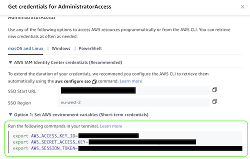

# Creating IAM User and policies for Terraform Cloud

In order to enable Terraform (local or cloud) to act on your behalf in creating resources, you need to construct the relevant IAM User and policies which will permit actions on AWS.

The directory `set-up-aws-terraform-deployer-iam-user` contains the example IAM Policy document template: `policy_template.json`. This is simply an example json document for reference and needs to be updated accordingly and added as an IAM Policy manually in the AWS Console or [programmatically via a script](#programmatically-via-a-script).

## Creating an IAM User and attaching an existing IAM policy to the user
- In this section, you will be guided on how to create an IAM User and attach an IAM Policy to the User programmatically using a script
- If you would like to dynamically generate an IAM Policy document to attach to an existing IAM User, follow the steps here: "[Dynamically generating an IAM Policy document for an existing IAM User](#dynamically-generating-an-iam-policy-document-for-an-existing-iam-user)"
  to generate the IAM Policy document and then follow Step 2 below to attach it as an IAM Policy to the User

1. Set up an AWS Profile on your local environment:
    - Visit your AWS SSO start page (e.g. "https://my-sso-portal.awsapps.com/start"), click the relevant AWS account and select "Command line or programmatic access"
    - Copy the commands from "Option 1: Set AWS environment variables (Short-term credentials)", paste in your terminal and press enter to set the credentials for your current terminal session - see screenshot below:
      
   
2. Create an IAM User (and/or update IAM Policy for the IAM User) that will be used to interact and deploy code to AWS and generate and store credentials for it 
   - Ensure you are in the `set-up-aws-terraform-deployer-iam-user` directory
   - Execute the following command and set the relevant positional arguments (see below): 
     - ```
       . ./setup_terraform_iam_user.sh <AWS_ACCOUNT_NUMBER> <AWS_REGION> <AWS_PROFILE_NAME> [<IAM_POLICY_TEMPLATE>] [<IAM_USER_NAME>] [<IAM_POLICY_NAME>]
       ```
       - Replace `<AWS_ACCOUNT_NUMBER>` with your AWS Account Number 
       - Replace `<AWS_REGION>` with the AWS Region for the AWS Account you are using
       - Replace `<AWS_PROFILE_NAME>` with the name of the AWS Profile to create in your AWS credentials and config files. This name should be all lowercase and hyphen separated. E.g. `terraform-aws-profile`.
       - Set the following optional positional command line arguments if necessary:
         - `[<IAM_POLICY_TEMPLATE>]`: the name of the file containing the policy that will be attached to the IAM User. This defaults to `policy_template.json`.
         - `[<IAM_USER_NAME>]`: the name of the AWS IAM User to create. This defaults to `terraform`. 
           - **Note: the value provided here should be in lowercase with no separators**
         - `[<IAM_POLICY_NAME>]`: the name of the policy as it will appear in the AWS IAM console. This defaults to `TerraformDeployerPolicy`.
           - **Note: The name provided here should be in [PascalCase](https://www.theserverside.com/definition/Pascal-case) with no spaces or separators between words**
       - Example: 
         ```
         . ./setup_terraform_iam_user.sh 123456789123 eu-west-2 terraform-aws-profile some_policy_template.json terraform DeployerPolicy
         ```
   - Once the script has finished executing:
       - An AWS IAM user will be created: `[<IAM_USER_NAME>]` with an attached policy `[<IAM_POLICY_NAME>]` containing permissions declared in `[<IAM_POLICY_TEMPLATE>]`
       - An AWS profile will be set up in your `~/.aws/config` directory with the name `<AWS_PROFILE_NAME>` and credentials added to your `~/.aws/credentials` file for the same profile
           - This new profile will be set in your current terminal session and the admin credentials that were previously exported to your terminal from Step 1 above will be removed
       - If you create a new terminal session, you will need to run the following command to set the AWS profile again
         - ```
           export AWS_PROFILE=<AWS_PROFILE_NAME>
           ```

## Dynamically generating an IAM Policy document for an existing IAM User

- If you are still developing your Terraform code and have an existing IAM User with AWS Admin permissions, you can dynamically generate a refined 
IAM policy json document containing the actions needed for your IAM User in order to have sufficient permissions to deploy your resources to your AWS account.
  - If you are starting from scratch, see the section above: [Creating an IAM User and attaching an existing IAM policy to the user](#creating-an-iam-user-and-attaching-an-existing-iam-policy-to-the-user), to add an admin AWS Profile & credentials to your local environment and create an IAM User
- There is a limitation to this process in that the dynamically generated policy document does not specify the ARNs of resources that the actions are performed on and will require intervention to get the IAM policy document in a ready state for attaching to the IAM User. 
This is due to how some of the AWS services used in this process work when using the AWS CLI.

  - To use this script to generate the policy document, execute the following command with the relevant optional positional arguments: 
    - ```
      ./generate_iam_policy_permissions_document.sh <AWS_ACCOUNT_NUMBER> <AWS_REGION> <IAM_USER_NAME>
      ```
        - Replace `<AWS_ACCOUNT_NUMBER>` with your AWS Account Number
        - Replace `<AWS_REGION>` with the AWS Region for the AWS Account you are using
        - Replace `<IAM_USER_NAME>` with the name of the AWS IAM User you want to dynamically generate the IAM Policy document for
    - Example usage:
      - ```
        ./generate_iam_policy_permissions_document.sh 123456789123 "eu-west-2" "terraform"
        ```

    - Whilst the script is running, you will get a prompt like below:
      - ```
        "Pausing script"
        "You can now run Terraform apply & then Terraform destroy"
        "CloudTrail Trail: TRAIL_NAME will log all actions performed & gather IAM permissions needed for IAM user: <IAM_USER_NAME>"
        ----------------------------------------------------
        "Once Terraform Apply & Destroy has completed, wait 5 minutes and then press enter to continue"
        ```
      - At this point, you should run `Terraform Apply` to provision all your resources in AWS, and then `Terraform Destroy` to remove all your resources from AWS
        - All the actions performed by Terraform on behalf of your user in AWS, for the past 2 hours, will be recorded for the policy document that will be generated
      - Once this has completed, wait 5 minutes and then press "Enter" on your keyboard to continue running the script
        - It is advised to wait a few minutes before resuming the script as AWS has a slight delay in recording the API calls made by Terraform 
    - Once the script has finished running, you will see an output in your terminal like below:
      - `"Generated skeleton IAM policy document and saved to: <IAM_USER_NAME>-generated-policy.json in current directory"`
    - An example of a generated IAM Policy document (e.g. "terraform-generated-policy.json") can be seen below:
      - ```
        {
            "Version": "2012-10-17",
            "Statement": [
            {
                "Sid": "SupportedServiceSid0",
                "Effect": "Allow",
                "Action": [
                    "dynamodb:DeleteTable",
                    "dynamodb:DescribeContinuousBackups",
                    "dynamodb:DescribeTable",
                    "dynamodb:DescribeTimeToLive",
                    "dynamodb:ListTagsOfResource",
                    "ec2:CreateLaunchTemplate",
                    "ec2:CreateRoute",
                    "ec2:CreateTags",
                    "ec2:DeleteInternetGateway",
                    "ec2:DeleteLaunchTemplate",
                    "ec2:DeleteNatGateway",
                    "kms:Decrypt",
                    "kms:DescribeKey",
                    "kms:GetKeyPolicy",
                    "kms:GetKeyRotationStatus",
                    "kms:ListResourceTags",
                    "kms:ScheduleKeyDeletion",
                    "secretsmanager:DeleteSecret",
                    "secretsmanager:DescribeSecret",
                    "secretsmanager:GetResourcePolicy",
                    "secretsmanager:GetSecretValue",
                    "sts:GetCallerIdentity"
            ],
            "Resource": "*"
            }
          ]
        }
        ```
    - At this point, you should review the document and add the relevant ARNs for the resources that are used in your AWS deployment
      - Once the policy document has been reviewed, you can generate an IAM Policy with the IAM Policy document and attach it to your IAM User by following Step 2 of [Creating an IAM User and attaching an existing IAM policy to the user](#creating-an-iam-user-and-attaching-an-existing-iam-policy-to-the-user) and passing the policy document to the `setup_terraform_iam_user.sh` script
    - **Note: All AWS resources created in this process are cleaned up/ deleted upon successful completion of the script**

### Technical documentation
- The above script generates the following resources, updating template files from `./cloudtrail_access_analyzer_templates` and storing then them in `./script_generated_files`, from which they are then used (this directory is ignored by git).
  - CloudTrail Trail (logging toggled on and off)
    - The CloudTrail Trail created will be called: `<IAM_USER_NAME>`
  - S3 Bucket with attached S3 Bucket Policy allowing the CloudTrail Trail to store logs in the bucket
    - The S3 bucket created will be called: `<IAM_USER_NAME>-cloudtrail-logs-<RANDOM_NUMBER>`
  - Access Analyzer IAM Role, IAM Policy and Assume Role Policy for policy generation using a generated CloudTrail details json document
    - The IAM Role created will be called: `<IAM_USER_NAME>-access-analyzer-generate-policy-role`
    - The IAM Policy created will be called: `<IAM_USER_NAME>-access-analyzer-generate-policy-role-policy`


### Further improvements
- Add check for existing AWS profile in AWS config and credentials file to avoid duplication of profiles
- Use flags instead of positional command line arguments to make script usage/execution simpler